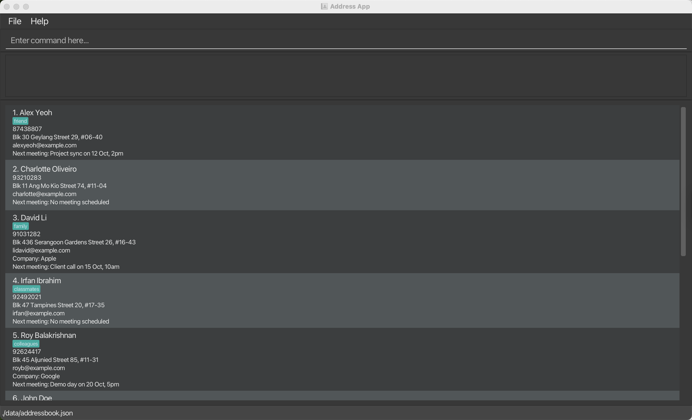

* This is **a real project for Software Engineering (SE) students**. 
  Example usages:
  * as a starting point of a course project (as opposed to writing everything from scratch)
  * as a case study
* The project simulates an ongoing software project for a desktop application (called _MeetCLI_) used for managing contact details.
  * It is **written in OOP fashion**. It provides a **reasonably well-written** code base **bigger** (around 6 KLoC) than what students usually write in beginner-level SE modules, without being overwhelmingly big.
  * It comes with a **reasonable level of user and developer documentation**.
* It is named `MeetCLI` because it was initially adapted from the AddressBook projects (`Level 1`, `Level 2`, `Level 3` ...) and rebranded for clarity.
* For the detailed documentation of this project, see the **[MeetCLI Product Website](https://ay2526s1-cs2103t-f15a-3.github.io/tp/)**.
* This project is maintained at **[AY2526S1-CS2103T-F15A-3/tp](https://github.com/AY2526S1-CS2103T-F15A-3/tp)**.
