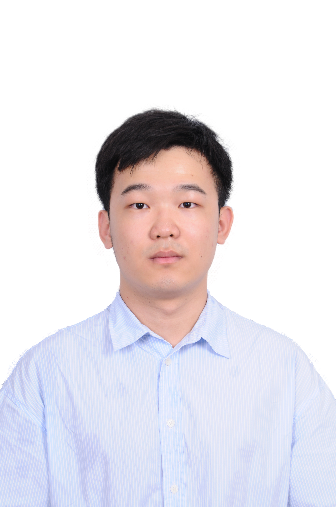

# About Us

We are a team based in the [School of Computing, National University of Singapore](http://www.comp.nus.edu.sg).

You can reach us at the email `seer[at]comp.nus.edu.sg`

## Project team

### Faizal Rafi

[[github](https://github.com/syemfai)]

* Role: Project Advisor

### Yu Zongmin

[[github](https://github.com/zongmin-yu)]

* Role: Developer
* Responsibilities: Meeting Management

### Qu Qiancheng

[[github](http://github.com/vincent-wat04)]

* Role: Developer
* Responsibilities: Data Persistence

### Neo Tsay Yong

[[github](http://github.com/nty-dev)]
[[portfolio](http://nty-dev.github.io)]

* Role: Developer
* Responsibilities: Command Architect (Designing and Writing the Command Module)

### Benn Tan

[[github](http://github.com/btjm123)]
[[portfolio](http://findbenn.com)]

* Role: Developer
* Responsibilities: Contacts Architect (Designing and Writing the Contacts Module)
