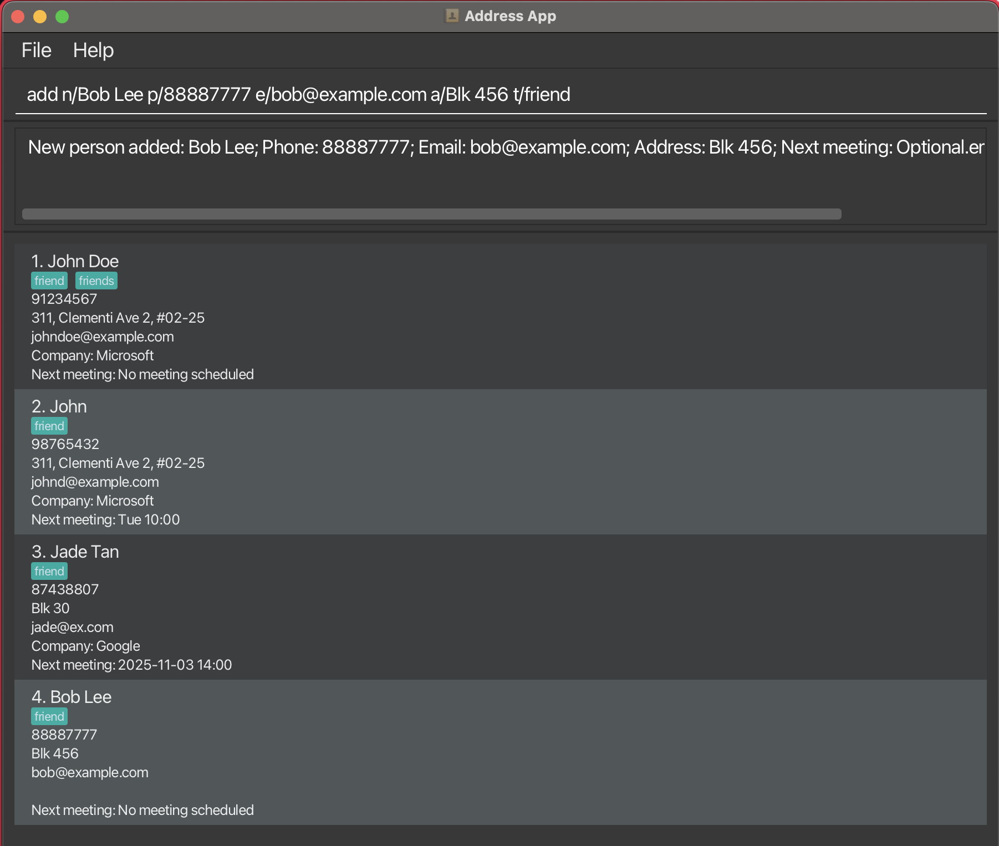
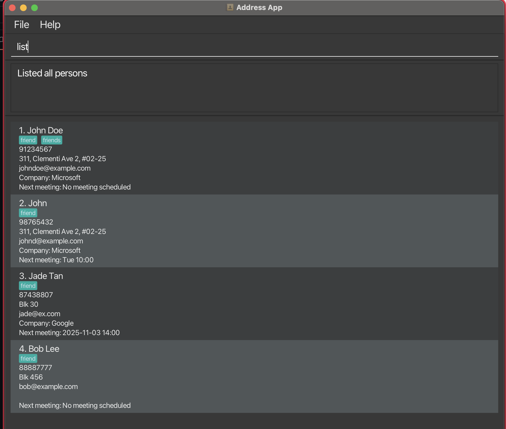
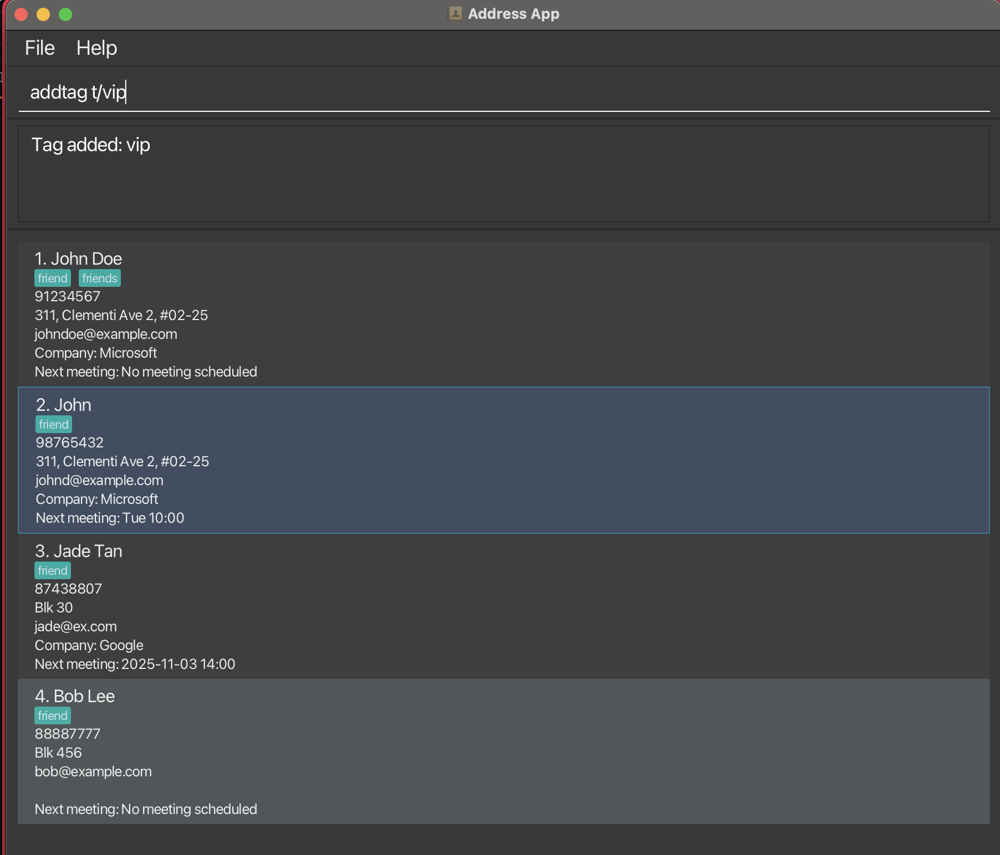
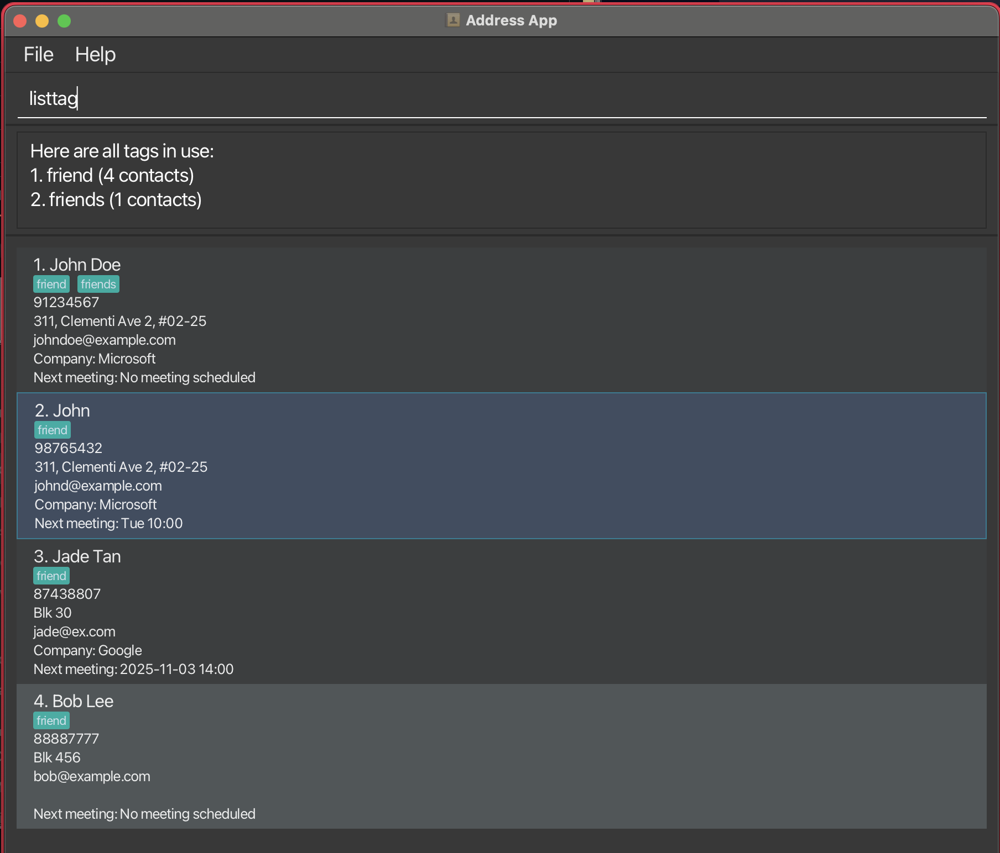
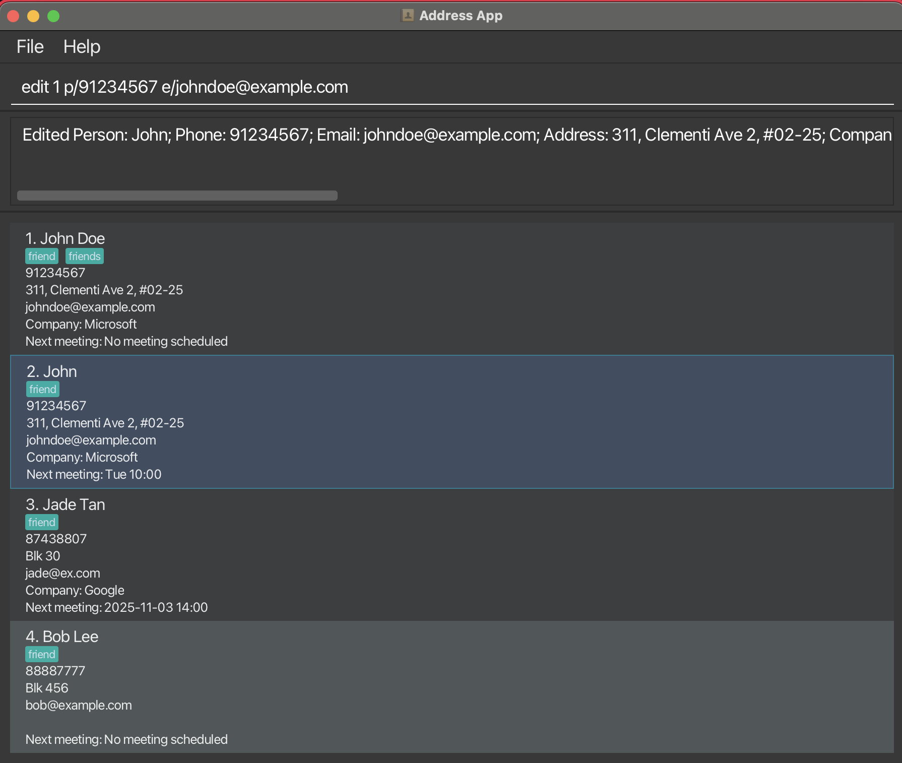
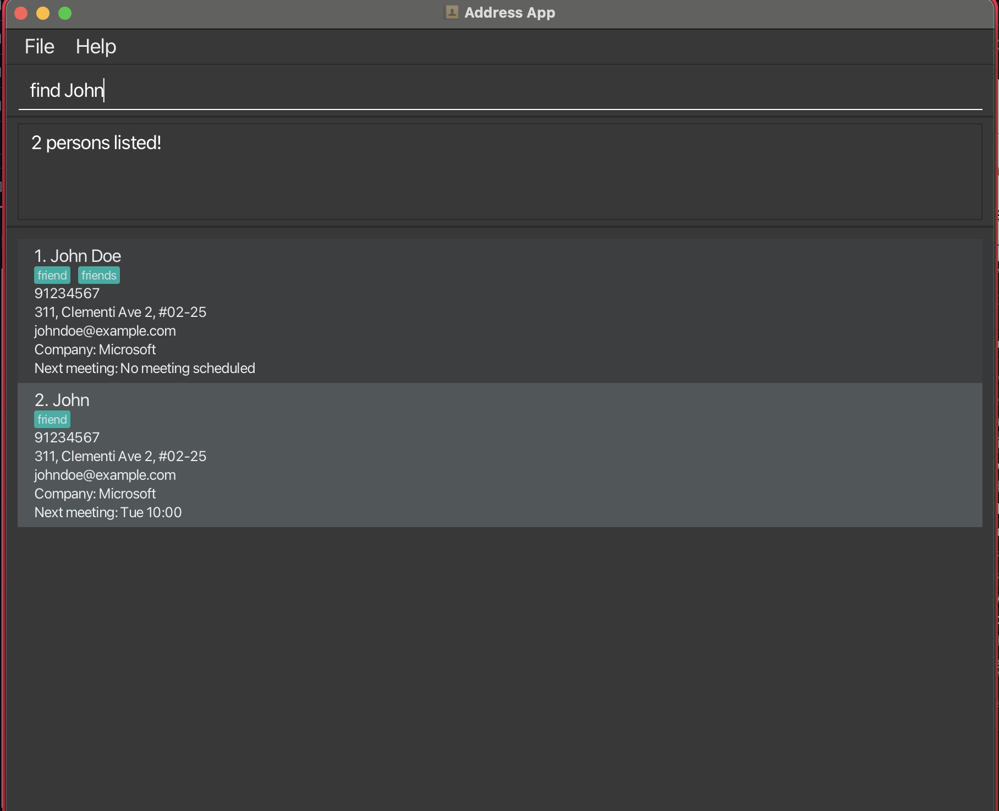
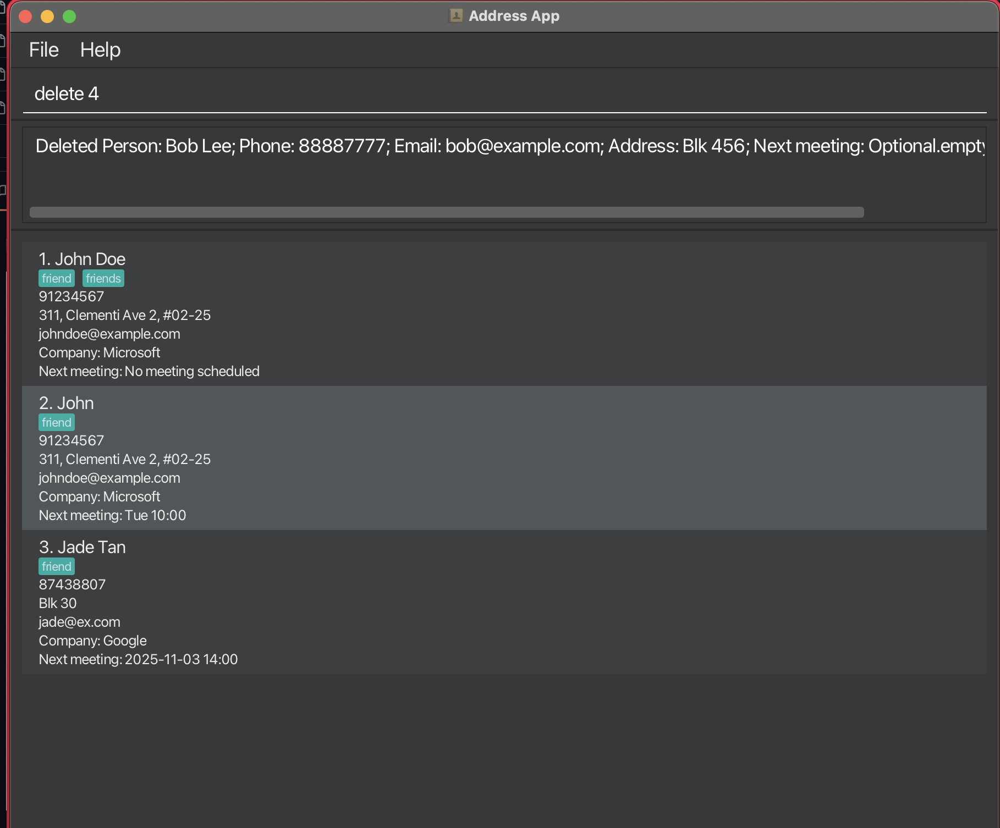
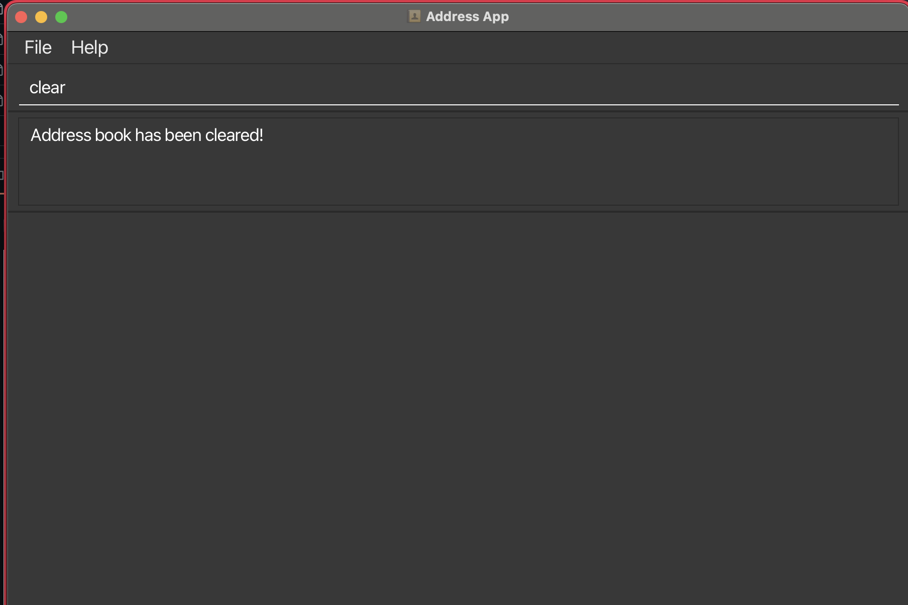

# MeetCLI User Guide

MeetCLI is a **desktop app for managing contacts and meetings, optimized for use via a Command Line Interface** (CLI) while still having the benefits of a Graphical User Interface (GUI). If you can type fast, MeetCLI can get your contact and meeting management tasks done faster than traditional GUI apps.

**Target Users**: Property agents, sales professionals, and business developers who need to manage large contact lists with company affiliations, tags, and meeting schedules.

--------------------------------------------------------------------------------------------------------------------

## Table of Contents
- [MeetCLI User Guide](#meetcli-user-guide)
  - [Table of Contents](#table-of-contents)
  - [Quick start](#quick-start)
  - [Features](#features)
    - [Key Features Overview](#key-features-overview)
    - [Viewing help : `help`](#viewing-help--help)
    - [Adding a person: `add`](#adding-a-person-add)
    - [Listing all persons : `list`](#listing-all-persons--list)
    - [Adding a tag: `addtag`](#adding-a-tag-addtag)
    - [Listing all tags: `listtag`](#listing-all-tags-listtag)
    - [Editing a person: `edit`](#editing-a-person-edit)
    - [Locating persons: `find`](#locating-persons-find)
    - [Deleting a person : `delete`](#deleting-a-person--delete)
    - [Clearing all entries : `clear`](#clearing-all-entries--clear)
    - [Exiting the program : `exit`](#exiting-the-program--exit)
    - [Saving the data](#saving-the-data)
    - [Editing the data file](#editing-the-data-file)
  - [Coming Soon](#coming-soon)
    - [Meeting Management Commands `[v1.5]`](#meeting-management-commands-v15)
    - [Other Planned Features `[v2.0 and beyond]`](#other-planned-features-v20-and-beyond)
  - [FAQ](#faq)
  - [Known issues](#known-issues)
  - [Command summary](#command-summary)

<!-- * Table of Contents -->
<page-nav-print />

--------------------------------------------------------------------------------------------------------------------

## Quick start

1. Ensure you have Java `17` or above installed in your Computer.<br>
   **Mac users:** Ensure you have the precise JDK version prescribed [here](https://se-education.org/guides/tutorials/javaInstallationMac.html).

1. Download the latest `.jar` file from [here](https://github.com/AY2526S1-CS2103T-F15A-3/tp/releases).

1. Copy the file to the folder you want to use as the _home folder_ for MeetCLI.

1. Open a command terminal, `cd` into the folder you put the jar file in, and use the `java -jar meetcli.jar` command to run the application.<br>
   A GUI similar to the below should appear in a few seconds. Note how the app contains some sample data.<br>
   

1. Type the command in the command box and press Enter to execute it. e.g. typing **`help`** and pressing Enter will open the help window.<br>
   Some example commands you can try:

   * `list` : Lists all contacts.

   * `add n/John Doe p/98765432 e/johnd@example.com a/John street, block 123, #01-01 c/Google m/Project review next Monday t/client` : Adds a contact named `John Doe` with company, meeting, and tag information.

   * `find c/Google` : Finds all contacts working at Google.

   * `listtag` : Shows all tags currently in use with contact counts.

   * `delete 3` : Deletes the 3rd contact shown in the current list.

   * `exit` : Exits the app.

1. Refer to the [Features](#features) below for details of each command.

--------------------------------------------------------------------------------------------------------------------

## Features

### Key Features Overview

MeetCLI extends traditional address book functionality with powerful features for business contact management:

**📊 Company Organization**
* Track which company/organization each contact belongs to
* Search and filter by company name
* Useful for managing clients across multiple organizations

**🏷️ Tag System**
* Categorize contacts with tags (e.g., `client`, `vip`, `prospect`)
* Tag registry ensures consistency across your database
* Search by single or multiple tags
* View tag usage statistics with `listtag`

**📅 Meeting Tracking**
* Record next meeting for each contact
* Meeting history infrastructure (full features coming in v1.5)
* Track meeting completion status and notes

**🔍 Advanced Search**
* Find by name, tags, company, or any combination
* Flexible AND/OR logic for precise filtering
* Case-insensitive search for user convenience

<box type="info" seamless>

**Notes about the command format:**<br>

* Words in `UPPER_CASE` are the parameters to be supplied by the user.<br>
  e.g. in `add n/NAME`, `NAME` is a parameter which can be used as `add n/John Doe`.

* Items in square brackets are optional.<br>
  e.g., `n/NAME [t/TAG]` can be used as `n/John Doe t/friend` or as `n/John Doe`.

* Items with `…`​ after them can be used multiple times including zero times.<br>
  e.g., `[t/TAG]…​` can be used as ` ` (i.e. 0 times), `t/friend`, `t/friend t/family` etc.

* Parameters can be in any order.<br>
  e.g., if the command specifies `n/NAME p/PHONE_NUMBER`, `p/PHONE_NUMBER n/NAME` is also acceptable.

* Extraneous parameters for commands that do not take in parameters (such as `help`, `list`, `listtag`, `exit` and `clear`) will be ignored.<br>
  e.g., if the command specifies `help 123`, it will be interpreted as `help`.

* If you are using a PDF version of this document, be careful when copying and pasting commands that span multiple lines as space characters surrounding line-breaks may be omitted when copied over to the application.

**Parameter Prefixes:**
* `n/` - Name
* `p/` - Phone number
* `e/` - Email
* `a/` - Address
* `c/` - Company
* `m/` - Meeting
* `t/` - Tag
* `o/` - Notes/Observations (for future commands)
</box>

### Viewing help : `help`

Shows a message explaining how to access the help page.


Format: `help`


### Adding a person: `add`

Adds a person to the address book with optional company, meeting, and tag information.

Format: `add n/NAME p/PHONE_NUMBER e/EMAIL a/ADDRESS [c/COMPANY] [m/NEXT_MEETING] [t/TAG]…​`

**Required Fields:**
* `n/NAME` - Person's full name
* `p/PHONE_NUMBER` - Contact phone number
* `e/EMAIL` - Email address
* `a/ADDRESS` - Physical address

**Optional Fields:**
* `c/COMPANY` - Company or organization name (defaults to empty if omitted)
* `m/NEXT_MEETING` - Next scheduled meeting details (defaults to "No meeting scheduled" if omitted)
* `t/TAG` - Tags for categorization (can specify multiple tags)

<box type="tip" seamless>

**Tips:**
* A person can have any number of tags (including 0)
* Tags must be added to the registry first using `addtag` before they can be used
* Company field can be left empty - useful for personal contacts
* Use descriptive meeting text like "Project review on Monday 2pm"
</box>

<box type="warning" seamless>

**Important:**
* All tags used must already exist in the tag registry. If you get an error like "Cannot add person with invalid tag", use `addtag t/TAGNAME` first, then retry the `add` command.
* Use `listtag` to see available tags.
</box>

Examples:
* `add n/John Doe p/98765432 e/johnd@example.com a/John street, block 123, #01-01` - Adds John Doe with only required fields
* `add n/Alice Wong p/91234567 e/alice@tech.com a/21 Computing Dr c/Google m/Sprint planning on Thu 3pm t/client t/vip` - Adds Alice with company, meeting, and tags
* `add n/Bob Lee p/88887777 e/bob@example.com a/Blk 456 t/friend` - Adds Bob with a tag but no company or meeting



### Listing all persons : `list`

Shows a list of all persons in the address book.

Format: `list`



### Adding a tag: `addtag`

Adds a new tag to the allowed tag registry, making it available for use in `add` and `edit` commands.

Format: `addtag t/TAG_NAME`

<box type="info" seamless>

**Notes:**
* Tag names must be alphanumeric (no spaces or special characters)
* Tag names are case-insensitive (e.g., `Friends` and `friends` are the same)
* Only tags in the registry can be used when adding/editing contacts
* Default tags: `friend`, `family`, `colleague`, `classmate`, `client`
</box>

Examples:
* `addtag t/vip` - Adds a "vip" tag to the registry
* `addtag t/prospect` - Adds a "prospect" tag for potential clients



<box type="warning" seamless>

**Common Errors:**
* `addtag t/important client` - ❌ Tags cannot contain spaces
* `addtag t/vip!` - ❌ Tags cannot contain special characters
* `addtag t/vip` (when vip already exists) - Shows "This tag already exists" message
</box>

### Listing all tags: `listtag`

Shows all unique tags currently in use across all contacts, sorted alphabetically with usage counts.

Format: `listtag`

**Features:**
* Alphabetically sorted (case-insensitive)
* Shows number of contacts for each tag
* Helpful for understanding your contact organization

Example output:
```
Here are all tags in use:
1. client (5 contacts)
2. colleague (3 contacts)
3. family (2 contacts)
4. friend (8 contacts)
5. vip (2 contacts)
```



<box type="tip" seamless>

**Tip:** Use `listtag` before using `find t/TAG` to see which tags are available for filtering!
</box>

Note: If no contacts have tags, displays `There are currently no tags.`

### Editing a person: `edit`

Edits an existing person in the address book.

Format: `edit INDEX [n/NAME] [p/PHONE] [e/EMAIL] [a/ADDRESS] [c/COMPANY] [m/NEXT_MEETING] [t/TAG]…​`

**Parameters:**
* `INDEX` - The index number shown in the displayed person list (must be a positive integer: 1, 2, 3, …)
* At least one optional field must be provided
* All fields are optional but you must specify at least one to edit

**Behavior:**
* Existing values will be updated to the input values
* When editing tags, ALL existing tags are replaced (not cumulative)
* To clear a field, provide the prefix without a value (e.g., `c/` clears company, `t/` clears all tags)

<box type="tip" seamless>

**Tips:**
* Use `list` or `find` first to see the index numbers
* To add a tag, it must exist in the registry. Use `addtag t/TAG` first if needed
* You can edit multiple fields in one command
* Company can be cleared by using `c/` with no value
</box>

Examples:
* `edit 1 p/91234567 e/johndoe@example.com` - Edits phone and email of the 1st person
* `edit 2 c/Microsoft m/Quarterly review next Wed` - Updates company and meeting for 2nd person
* `edit 3 n/Betsy Crower t/` - Changes name and clears all tags
* `edit 1 t/client t/vip` - Replaces all existing tags with "client" and "vip"



### Locating persons: `find`

Finds persons by name keywords, tags, and/or company. You can use any combination of these criteria.

Format: `find [KEYWORD [MORE_KEYWORDS]...] [t/TAG [t/TAG]...] [c/COMPANY [c/COMPANY]...]`

**Name Search:**
* Case-insensitive substring match. e.g., `han` will match `Hans`
* Multiple keywords use OR logic. e.g., `Hans Bo` returns contacts matching `Hans` OR `Bo`

**Tag Search:**
* Exact, case-sensitive match
* Multiple `t/` use AND logic. e.g., `t/client t/vip` returns contacts with BOTH tags

**Company Search:**
* Case-insensitive substring match
* Multiple `c/` use OR logic. e.g., `c/Google c/Microsoft` returns contacts at Google OR Microsoft

**Mixed Criteria:**
* When using multiple types (name, tags, company), all criteria must be satisfied (AND logic)
* Example: `find alice t/client c/Google` returns contacts named Alice who are tagged as client AND work at Google

Examples:
* `find John` returns `john` and `John Doe`
* `find alex david` returns `Alex Yeoh`, `David Li`
* `find t/client` returns all contacts tagged as client
* `find t/client t/vip` returns contacts with both client AND vip tags
* `find c/Google` returns all contacts working at Google
* `find c/Google c/Microsoft` returns contacts at Google OR Microsoft
* `find alice t/priority c/Microsoft` returns Alice who is tagged priority AND works at Microsoft



### Deleting a person : `delete`

Deletes the specified person from the address book.

Format: `delete INDEX`

* Deletes the person at the specified `INDEX`.
* The index refers to the index number shown in the displayed person list.
* The index **must be a positive integer** 1, 2, 3, …​

Examples:
* `list` followed by `delete 2` deletes the 2nd person in the address book.
* `find Betsy` followed by `delete 1` deletes the 1st person in the results of the `find` command.



### Clearing all entries : `clear`

Clears all entries from the address book.

Format: `clear`



### Exiting the program : `exit`

Exits the program.

Format: `exit`

### Saving the data

AddressBook data are saved in the hard disk automatically after any command that changes the data. There is no need to save manually.

### Editing the data file

AddressBook data are saved automatically as a JSON file `[JAR file location]/data/addressbook.json`. Advanced users are welcome to update data directly by editing that data file.

<box type="warning" seamless>

**Caution:**
If your changes to the data file makes its format invalid, AddressBook will discard all data and start with an empty data file at the next run.  Hence, it is recommended to take a backup of the file before editing it.<br>
Furthermore, certain edits can cause the AddressBook to behave in unexpected ways (e.g., if a value entered is outside the acceptable range). Therefore, edit the data file only if you are confident that you can update it correctly.
</box>

--------------------------------------------------------------------------------------------------------------------

## Coming Soon

### Meeting Management Commands `[v1.5]`

**Mark Meeting as Completed: `mark`**

Mark the next upcoming meeting for a contact as completed, with optional notes.

Format: `mark INDEX [o/NOTES]`

* Marks the next meeting of the person at `INDEX` as completed
* Optional notes can be added to record discussion points or outcomes
* Once marked, the meeting moves to history and won't show as "Next meeting"

Examples:
* `mark 1` - Marks the next meeting for person 1 as completed
* `mark 2 o/Discussed project timeline and next steps` - Marks meeting as completed with notes

**View Meeting History: `history`**

View all completed meetings for a contact, including meeting notes.

Format: `history INDEX`

* Shows all past meetings with their completion status and notes
* Displays meeting dates, times, and participants
* Helps track communication history with clients

Example:
* `history 1` - Shows all completed meetings for person 1

**Add Meeting: `addmeeting`**

Add a new meeting to a contact with full details (title, date, time, participants).

Format: `addmeeting INDEX ti/TITLE d/DATE s/START_TIME e/END_TIME [o/NOTES]`

* Supports multiple meetings per contact
* Structured meeting data (not just free-form text)
* Automatic validation of date/time formats

Example:
* `addmeeting 1 ti/Project Review d/2025-12-01 s/14:00 e/15:30 o/Quarterly review`

**Edit Meeting: `editmeeting`**

Edit details of an existing meeting.

Format: `editmeeting INDEX MEETING_INDEX [ti/TITLE] [d/DATE] [s/START_TIME] [e/END_TIME] [o/NOTES]`

Example:
* `editmeeting 1 1 d/2025-12-02 s/15:00` - Reschedule the first meeting

### Other Planned Features `[v2.0 and beyond]`

**Enhanced Meeting Features:**
* Meeting reminders and notifications
* Calendar view for all meetings
* Export meetings to calendar apps (iCal format)
* Recurring meetings support

**Advanced Search and Filtering:**
* Search by meeting date ranges
* Filter by upcoming meetings in next N days
* Combined filters for complex queries

**Data Management:**
* Archiving old contacts
* Bulk import/export (CSV format)
* Data backup and restore

--------------------------------------------------------------------------------------------------------------------

## FAQ

**Q**: How do I transfer my data to another Computer?<br>
**A**: Install the app in the other computer and overwrite the empty data file it creates with the file that contains the data of your previous MeetCLI home folder.

**Q**: Can I add custom tags?<br>
**A**: Yes! Use the `addtag t/TAGNAME` command to add new tags to the allowed tag list. Once added, you can use them in `add` and `edit` commands.

**Q**: How do I see all the tags I've created?<br>
**A**: Use the `listtag` command to see all tags currently in use, along with how many contacts have each tag.

**Q**: Can I search for multiple companies at once?<br>
**A**: Yes! Use `find c/COMPANY1 c/COMPANY2` to find contacts at either company (OR logic).

**Q**: What happens to my meeting when I mark it as completed?<br>
**A**: The `mark` command (coming in v1.5) will move the meeting to your history. It won't show as "Next meeting" anymore, but you can view it using the `history` command.

**Q**: Can I have multiple meetings for one contact?<br>
**A**: The infrastructure supports multiple meetings per contact (added in v1.4). Full meeting management commands (`addmeeting`, `mark`, `history`) are coming in v1.5.

**Q**: Why can't I use certain tags?<br>
**A**: MeetCLI uses a tag registry to ensure consistency. Only tags in the allowed list can be used. Use `addtag` to add new tags, or check existing tags with `listtag`.

--------------------------------------------------------------------------------------------------------------------

## Known issues

1. **When using multiple screens**, if you move the application to a secondary screen, and later switch to using only the primary screen, the GUI will open off-screen. The remedy is to delete the `preferences.json` file created by the application before running the application again.
2. **If you minimize the Help Window** and then run the `help` command (or use the `Help` menu, or the keyboard shortcut `F1`) again, the original Help Window will remain minimized, and no new Help Window will appear. The remedy is to manually restore the minimized Help Window.

--------------------------------------------------------------------------------------------------------------------

## Command summary

Action     | Format, Examples
-----------|----------------------------------------------------------------------------------------------------------------------------------------------------------------------
**Add**    | `add n/NAME p/PHONE_NUMBER e/EMAIL a/ADDRESS [c/COMPANY] [m/NEXT_MEETING] [t/TAG]…​` <br> e.g., `add n/James Ho p/22224444 e/jamesho@example.com a/123, Clementi Rd, 1234665 c/Acme Corp m/Catch up next Tue t/client`
**AddTag** | `addtag t/TAG`<br> e.g., `addtag t/vip`
**Clear**  | `clear`
**Delete** | `delete INDEX`<br> e.g., `delete 3`
**Edit**   | `edit INDEX [n/NAME] [p/PHONE_NUMBER] [e/EMAIL] [a/ADDRESS] [c/COMPANY] [m/NEXT_MEETING] [t/TAG]…​`<br> e.g., `edit 2 c/Microsoft m/Client call on Friday`
**Exit**   | `exit`
**Find**   | `find [KEYWORD]... [t/TAG]... [c/COMPANY]...`<br> e.g., `find alice t/client c/Google`
**Help**   | `help`
**List**   | `list`
**ListTag** | `listtag`
